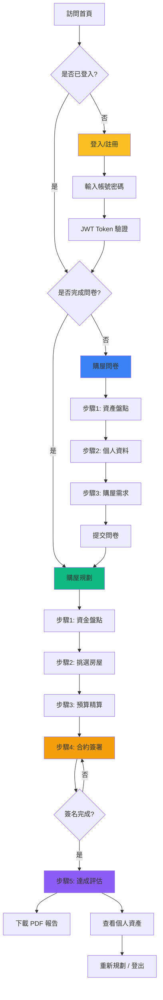
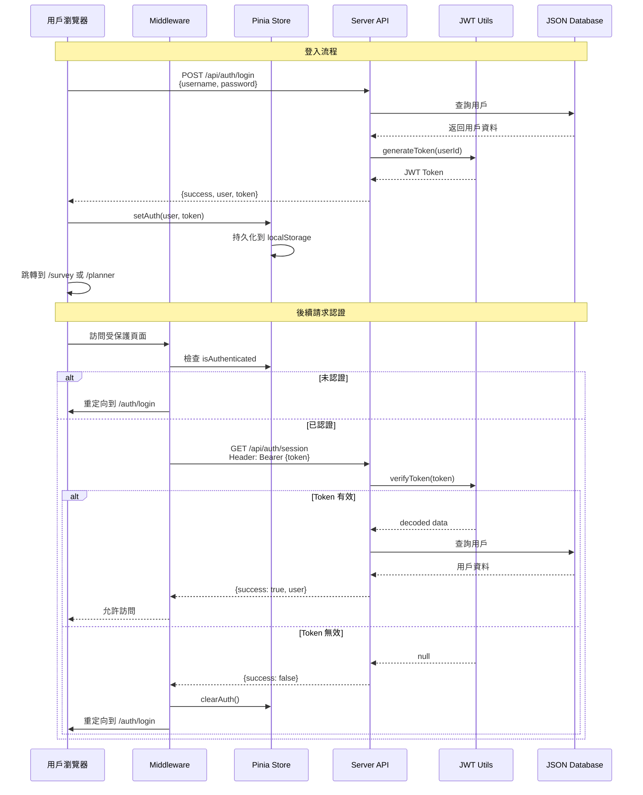
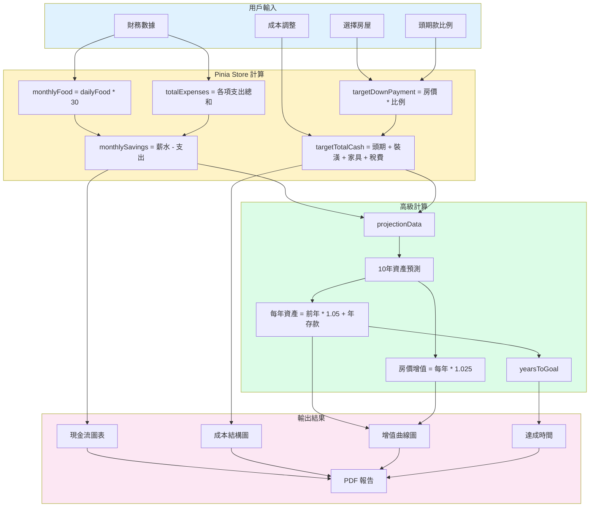
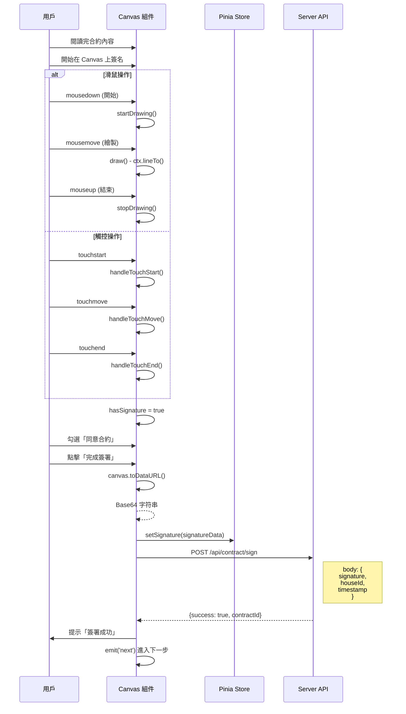

# 🏗️ 專案架構與流程圖

## 系統架構概覽

```
┌─────────────────────────────────────────────────────────────────────┐
│                         DreamHouse 購屋規劃系統                        │
└─────────────────────────────────────────────────────────────────────┘

┌─────────────────────────────────────────────────────────────────────┐
│                            前端層 (Client)                            │
│  ┌──────────┐  ┌──────────┐  ┌──────────┐  ┌──────────┐           │
│  │   首頁   │  │ 登入註冊 │  │ 購屋問卷 │  │ 購屋規劃 │           │
│  │  index   │─→│   auth   │─→│  survey  │─→│ planner  │           │
│  └──────────┘  └──────────┘  └──────────┘  └──────────┘           │
│                      │             │              │                 │
│                      └─────────────┴──────────────┘                 │
│                                    │                                │
│  ┌─────────────────────────────────▼────────────────────────┐      │
│  │              Vue3 + Nuxt3 渲染層                           │      │
│  │  ┌──────────────┐  ┌──────────────┐  ┌──────────────┐   │      │
│  │  │ Components   │  │  Composables  │  │  Middleware  │   │      │
│  │  │ (UI 組件)     │  │  (邏輯復用)   │  │  (路由守衛)   │   │      │
│  │  └──────────────┘  └──────────────┘  └──────────────┘   │      │
│  └────────────────────────────────────────────────────────┘      │
└─────────────────────────────┬───────────────────────────────────────┘
                              │
┌─────────────────────────────▼───────────────────────────────────────┐
│                         狀態管理層 (Pinia)                            │
│  ┌──────────────┐  ┌──────────────┐  ┌──────────────┐             │
│  │  authStore   │  │ plannerStore  │  │ surveyStore   │             │
│  │  (用戶認證)   │  │  (購屋規劃)   │  │   (問卷)      │             │
│  └──────┬───────┘  └──────┬───────┘  └──────┬───────┘             │
│         │                  │                  │                     │
│         └──────────────────┴──────────────────┘                     │
│                            │                                        │
│              ┌─────────────▼─────────────┐                          │
│              │  persistedState (持久化)   │                          │
│              │  (localStorage)            │                          │
│              └─────────────┬─────────────┘                          │
└────────────────────────────┼──────────────────────────────────────┘
                              │ $fetch (HTTP)
┌─────────────────────────────▼───────────────────────────────────────┐
│                      後端 API 層 (Nuxt Server)                        │
│  ┌──────────────┐  ┌──────────────┐  ┌──────────────┐             │
│  │  /api/auth/* │  │ /api/houses/* │  │ /api/survey/*│             │
│  │  (認證 API)   │  │  (房屋 API)   │  │  (問卷 API)  │             │
│  └──────┬───────┘  └──────┬───────┘  └──────┬───────┘             │
│         │                  │                  │                     │
│         └──────────────────┴──────────────────┘                     │
│                            │                                        │
│              ┌─────────────▼─────────────┐                          │
│              │  JWT 驗證 & 中間件         │                          │
│              └─────────────┬─────────────┘                          │
└────────────────────────────┼──────────────────────────────────────┘
                              │
┌─────────────────────────────▼───────────────────────────────────────┐
│                        數據層 (Mock Database)                         │
│  ┌──────────────┐  ┌──────────────┐  ┌──────────────┐             │
│  │  users.json  │  │ houses.json   │  │  survey.json │             │
│  │  (用戶數據)   │  │  (房屋數據)   │  │  (問卷數據)  │             │
│  └──────────────┘  └──────────────┘  └──────────────┘             │
└─────────────────────────────────────────────────────────────────────┘
```

## 用戶流程圖



## 認證流程時序圖



## 購屋規劃數據流程



## 組件層級結構

```
pages/planner.vue (主容器)
├── PlannerStepper.vue (步驟導航)
│   ├── 步驟按鈕 * 5
│   └── 進度條
│
├── StepFinance.vue (步驟1)
│   ├── ElCard (Hero Banner)
│   ├── ElCard (財務表單)
│   │   ├── ElInputNumber * N
│   │   └── ElFormItem * N
│   └── ElCard (統計卡片)
│
├── StepSearch.vue (步驟2)
│   ├── 篩選器 (Region + Type)
│   └── HouseCard * N
│       ├── 圖片
│       ├── 標籤
│       └── 選擇按鈕
│
├── StepBudget.vue (步驟3)
│   ├── ElCard (預算表格)
│   │   └── ElTable
│   │       └── ElInputNumber (可編輯)
│   └── 頭期款比例選擇器
│
├── StepContract.vue (步驟4)
│   ├── 合約內容展示
│   │   ├── 分頁導航
│   │   └── 內容文本
│   └── SignaturePad (簽名區)
│       ├── Canvas 畫布
│       ├── 清除按鈕
│       └── 確認 Checkbox
│
├── StepEvaluation.vue (步驟5)
│   ├── 總結卡片
│   ├── 成本圖表 (Pie Chart)
│   ├── 增值圖表 (Line Chart)
│   └── 建議清單
│
└── ReportModal.vue (PDF 報告)
    ├── ElDialog
    └── 可列印內容區
        ├── 財務現況表
        ├── 購屋目標表
        └── 執行建議
```

## 狀態管理架構

```
Pinia Stores
│
├── useAuthStore
│   ├── state
│   │   ├── user (User | null)
│   │   ├── token (string | null)
│   │   └── isAuthenticated (boolean)
│   ├── getters
│   │   ├── getUser
│   │   ├── getToken
│   │   └── isLoggedIn
│   └── actions
│       ├── login(username, password)
│       ├── register(userData)
│       ├── logout()
│       └── checkSession()
│
├── usePlannerStore
│   ├── state
│   │   ├── currentStep
│   │   ├── financeData (收支數據)
│   │   ├── selectedHouse (選中房屋)
│   │   ├── costsData (各項成本)
│   │   ├── downPaymentRate (頭期款比例)
│   │   └── signature (簽名數據)
│   ├── getters (自動計算)
│   │   ├── monthlyFood
│   │   ├── totalExpenses
│   │   ├── monthlySavings
│   │   ├── targetDownPayment
│   │   ├── targetTotalCash
│   │   ├── projectionData (10年預測)
│   │   └── yearsToGoal (達成時間)
│   └── actions
│       ├── setStep(step)
│       ├── nextStep()
│       ├── prevStep()
│       ├── updateFinanceData(data)
│       ├── selectHouse(house)
│       ├── updateCostsData(data)
│       └── setSignature(signature)
│
└── useSurveyStore
    ├── state
    │   ├── assets (各類資產)
    │   ├── survey (問卷答案)
    │   └── isCompleted
    ├── getters
    │   ├── totalAssets
    │   └── assetDistribution
    └── actions
        ├── updateAssets(assets)
        ├── updateSurvey(survey)
        └── submitSurvey()
```

## API 路由結構

```
/api
├── /auth
│   ├── POST   /login        # 用戶登入
│   ├── POST   /register     # 用戶註冊
│   ├── GET    /session      # 驗證 Session
│   └── POST   /logout       # 用戶登出
│
├── /houses
│   └── GET    /list         # 獲取房屋列表
│       └── query: region, type
│
├── /survey
│   └── POST   /submit       # 提交問卷
│       └── body: {assets, survey}
│
└── /contract
    └── POST   /sign         # 提交合約簽名
        └── body: {signature, houseId, timestamp}
```

## 中間件執行流程

```
用戶請求頁面
     │
     ▼
┌─────────────────┐
│  Nuxt 路由層    │
└────────┬────────┘
         │
         ▼
┌─────────────────┐
│  definePageMeta │ ← 頁面定義 middleware
│  middleware: ... │
└────────┬────────┘
         │
         ▼
    ┌────────┐
    │ auth.ts│ ← 檢查是否登入
    └───┬────┘
        │
        ├─ 未登入 ──→ navigateTo('/auth/login')
        │
        └─ 已登入 ──→ 繼續
                      │
                      ▼
                 ┌──────────┐
                 │ guest.ts │ ← 檢查是否為訪客頁面
                 └─────┬────┘
                       │
                       ├─ 已登入訪問登入頁 ──→ navigateTo('/planner')
                       │
                       └─ 允許訪問 ──→ 渲染頁面
```

## 電子簽名實現流程



---

**文檔版本：** v1.0  
**最後更新：** 2026-03-01  
**維護者：** Kate
