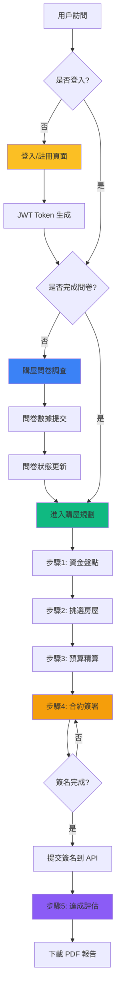
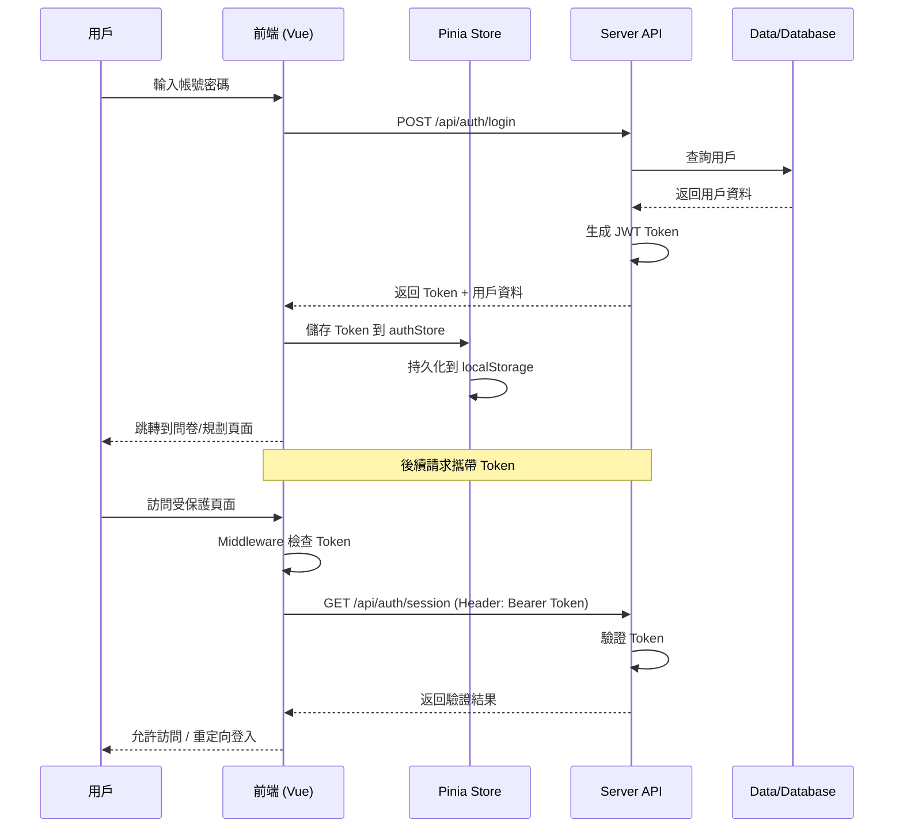
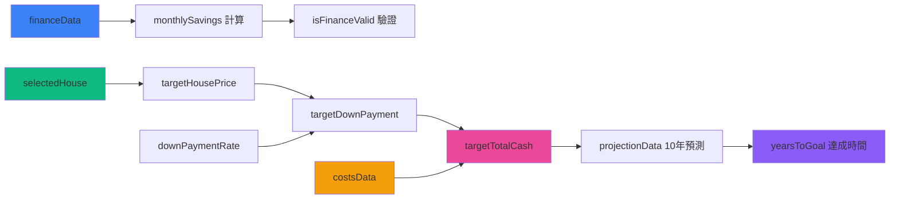

# 🏠 DreamHouse 購屋規劃系統

一個基於 Vue3 + Nuxt3 的智能購屋財務規劃平台，幫助用戶進行全方位的購屋財務評估與規劃。

## 📋 專案理念

### 核心理念
買房是人生大事，不僅僅是看房價，更需要全面評估個人財務狀況、現金流、未來儲蓄能力等多個維度。DreamHouse 旨在提供一個**親民、陽光、專業**的購屋規劃工具，讓每個人都能輕鬆制定屬於自己的購屋藍圖。

### 設計原則
1. **用戶友好**：簡潔明了的操作流程，降低使用門檻
2. **數據驅動**：基於真實財務數據進行精準計算
3. **流程完整**：涵蓋從資金盤點到合約簽署的完整購屋流程
4. **安全可靠**：採用 Token 認證機制，保護用戶隱私數據

---

## 🏗️ 專案架構

### 目錄結構

```
nuxt3.vue3.public.account/
├── pages/                          # 頁面路由
│   ├── auth/                       # 認證相關頁面
│   │   ├── login.vue              # 登入頁面
│   │   └── register.vue           # 註冊頁面
│   ├── survey.vue                 # 購屋問卷調查
│   ├── planner.vue                # 購屋規劃主頁（5步驟）
│   ├── profile.vue                # 個人資產總覽
│   └── AssetPlanner/              # 原有資產規劃模組（保留）
│
├── components/                     # 共用組件
│   ├── planner/                   # 購屋規劃相關組件
│   │   ├── PlannerStepper.vue    # 步驟導航條
│   │   ├── StepFinance.vue       # 步驟1：資金盤點
│   │   ├── StepSearch.vue        # 步驟2：挑選房屋
│   │   ├── StepBudget.vue        # 步驟3：預算精算
│   │   ├── StepContract.vue      # 步驟4：合約重點（含簽名）
│   │   ├── StepEvaluation.vue    # 步驟5：達成評估
│   │   └── ReportModal.vue       # PDF 報告下載模態框
│   └── pages/                     # 其他頁面級組件
│
├── stores/                         # Pinia 狀態管理
│   ├── useAuthStore.ts            # 🔐 用戶認證狀態
│   ├── usePlannerStore.ts         # 📊 購屋規劃狀態
│   └── useSurveyStore.ts          # 📝 問卷數據狀態
│
├── server/                         # 後端 API
│   ├── api/                       # API 路由
│   │   ├── auth/                  # 認證 API
│   │   │   ├── login.post.ts     # 登入
│   │   │   ├── register.post.ts  # 註冊
│   │   │   └── session.get.ts    # 會話驗證
│   │   ├── houses/
│   │   │   └── list.get.ts       # 房屋列表
│   │   ├── survey/
│   │   │   └── submit.post.ts    # 問卷提交
│   │   └── contract/
│   │       └── sign.post.ts      # 合約簽署
│   ├── data/                      # 假數據
│   │   ├── houses.json            # 房屋數據
│   │   └── users.json             # 用戶數據
│   └── utils/
│       └── jwt.ts                 # JWT 工具函數
│
├── middleware/                     # 路由中間件
│   ├── auth.ts                    # 認證保護中間件
│   └── guest.ts                   # 訪客限制中間件
│
├── composables/                    # 組合式函數
│   ├── useAuthData.ts             # 認證相關邏輯
│   └── useSetting.ts              # 設定相關邏輯
│
└── assets/                         # 靜態資源
    └── css/                       # 樣式文件
        └── global.css             # 全局樣式
```

### 系統架構圖

```
┌─────────────────────────────────────────────────────────────┐
│                         前端層 (Vue3 + Nuxt3)                  │
│                                                               │
│  ┌──────────────┐  ┌──────────────┐  ┌──────────────┐      │
│  │  登入/註冊   │  │  購屋問卷     │  │  購屋規劃     │      │
│  │  (Auth)      │─→│  (Survey)     │─→│  (Planner)    │      │
│  └──────────────┘  └──────────────┘  └──────────────┘      │
│         │                 │                  │               │
│         └─────────────────┴──────────────────┘               │
│                           │                                  │
└───────────────────────────┼──────────────────────────────────┘
                            │ Token Auth
┌───────────────────────────┼──────────────────────────────────┐
│                           ▼                                  │
│                    Pinia State Management                    │
│  ┌──────────────┐  ┌──────────────┐  ┌──────────────┐      │
│  │  authStore   │  │ plannerStore  │  │ surveyStore   │      │
│  └──────────────┘  └──────────────┘  └──────────────┘      │
└───────────────────────────┼──────────────────────────────────┘
                            │ $fetch
┌───────────────────────────┼──────────────────────────────────┐
│                           ▼                                  │
│                    Server API Layer (Nuxt Server)            │
│  ┌──────────────┐  ┌──────────────┐  ┌──────────────┐      │
│  │  /api/auth/* │  │ /api/houses/*│  │/api/survey/* │      │
│  └──────────────┘  └──────────────┘  └──────────────┘      │
│         │                 │                  │               │
│         └─────────────────┴──────────────────┘               │
│                           │                                  │
│                           ▼                                  │
│                  ┌──────────────────┐                        │
│                  │  JSON Data Files  │                        │
│                  │  (Mock Database)  │                        │
│                  └──────────────────┘                        │
└─────────────────────────────────────────────────────────────┘
```

---

## 🛠️ 技術棧

### 核心框架
- **Vue 3.4.38** - 漸進式 JavaScript 框架
- **Nuxt 3.16.2** - Vue.js 的服務端渲染框架
- **TypeScript 5.4.5** - 靜態類型檢查

### UI 框架
- **Element Plus 2.9.4** - 基於 Vue3 的企業級 UI 組件庫
- **@element-plus/icons-vue 2.3.1** - Element Plus 圖標庫
- **@element-plus/nuxt 1.1.1** - Element Plus Nuxt 模組

### 狀態管理
- **Pinia 2.2.2** - Vue 官方推薦的狀態管理庫
- **@pinia/nuxt 0.5.3** - Pinia Nuxt 模組

### 數據處理
- **Handsontable 15.2.0** - 強大的數據表格組件
- **@handsontable/vue3 15.2.0** - Handsontable Vue3 適配器
- **ExcelJS 4.4.0** - Excel 文件處理
- **Dayjs 1.11.13** - 輕量級日期處理庫
- **Decimal.js 10.4.3** - 精確的數值計算

### 表單驗證
- **Vee-Validate 4.13.1** - Vue 表單驗證庫
- **@vee-validate/rules 4.13.1** - Vee-Validate 規則集
- **Yup 1.4.0** - JavaScript 數據驗證庫

### 認證與安全
- **jsonwebtoken 9.0.2** - JWT Token 生成與驗證
- **@types/jsonwebtoken 9.0.6** - JWT TypeScript 類型定義

### 工具庫
- **IMask 7.6.1** - 輸入遮罩庫
- **vue-imask 7.6.1** - IMask Vue3 適配器

---

## 🎯 核心功能

### 1. 用戶認證系統
- ✅ 登入 / 註冊功能
- ✅ JWT Token 認證
- ✅ Session 持久化
- ✅ 路由守衛保護

### 2. 購屋問卷調查
- ✅ 三階段問卷流程
  - 資產盤點（現金、股票、基金等）
  - 個人資料（年齡、職業、收入）
  - 購屋需求（區域、類型、預算）
- ✅ 數據驗證與計算
- ✅ 問卷數據持久化存儲

### 3. 購屋規劃系統（5 步驟）

#### 步驟 1：資金盤點
- 輸入當前可動用資金
- 計算每月現金流
- 即時顯示每月可存金額
- 財務健康度檢查

#### 步驟 2：挑選房屋
- 房屋列表展示（支持篩選：區域/類型）
- 房屋卡片詳細資訊
- 單選房屋功能
- 外部房屋網站連結

#### 步驟 3：預算精算
- 使用 **Handsontable** 進行動態預算表格編輯
- 自動計算頭期款、裝潢、家具、稅費等
- 頭期款比例調整（20%/25%/30%）
- 即時顯示總目標現金

#### 步驟 4：合約重點教學
- 分頁展示合約條款
- **電子簽名功能（Canvas 實現）**
  - 支持滑鼠和觸控簽名
  - 簽名清除與重簽
  - 簽名數據 Base64 存儲
- 合約確認 Checkbox
- 簽名提交至後端 API

#### 步驟 5：達成評估
- 顯示財務目標達成時間
- 資產增值預測（10 年期）
- 成本結構圖表
- PDF 報告下載功能
- 顧問建議與防雷提醒

### 4. 個人資產總覽
- 資產配置展示
- 購屋進度追蹤
- 快速操作入口
- 用戶資料管理

---

## 📊 數據流程圖



### 認證流程圖



### 購屋規劃數據流



---

## 🔐 安全機制

### Token 認證流程
1. 用戶登入後，後端生成 JWT Token
2. Token 儲存在 Pinia Store 並持久化到 localStorage
3. 所有受保護的 API 請求需攜帶 Token（Bearer Authentication）
4. Middleware 在路由層面進行 Token 驗證

### 路由保護
- **auth.ts middleware**: 保護需要登入的頁面（/planner, /survey, /profile）
- **guest.ts middleware**: 防止已登入用戶訪問登入/註冊頁

---

## 🚀 快速開始

### 安裝依賴

```bash
npm install
```

### 開發模式

```bash
npm run dev
```

訪問：`http://localhost:3000`

### 測試帳號

```
帳號：demo
密碼：demo123
```

或

```
帳號：kate
密碼：kate123
```

### 生產環境構建

```bash
npm run build
```

### 生產環境預覽

```bash
npm run preview
```

---

## 📦 專案特色

### 1. 全流程覆蓋
從用戶註冊、問卷調查、財務分析、房屋挑選、預算計算、合約簽署到最終報告，完整覆蓋購屋全流程。

### 2. 智能計算引擎
- 自動計算每月可存金額
- 動態調整頭期款比例
- 10 年資產增值預測（5% 年化報酬率）
- 購屋目標達成時間估算

### 3. 互動式合約簽名
- Canvas 實現的電子簽名功能
- 支持滑鼠和觸控操作
- 簽名數據 Base64 編碼存儲
- 簽名提交到後端 API 記錄

### 4. 響應式設計
- 完整支持桌面端和移動端
- 使用 Element Plus 組件庫
- Tailwind 風格的 Utility Class
- 友好的用戶體驗

### 5. 狀態持久化
- 使用 Pinia + persistedState
- 用戶認證狀態持久化
- 購屋規劃數據持久化
- 問卷數據持久化

---

## 🔮 未來擴展

### 短期計劃
- [ ] 整合真實銀行貸款試算 API
- [ ] 整合真實房屋資訊平台 API (591, 永慶)
- [ ] 添加更多圖表展示（ECharts / Chart.js）
- [ ] 實現 PDF 報告自動生成與下載

### 中期計劃
- [ ] 多用戶對比分析
- [ ] 購屋知識庫與 AI 顧問
- [ ] 房貸利率即時追蹤
- [ ] 區域房價走勢分析

### 長期計劃
- [ ] 社群功能（購屋經驗分享）
- [ ] 專業顧問線上諮詢
- [ ] 區塊鏈合約存證
- [ ] 國際版本（日本、美國市場）

---

## 👥 開發團隊

本專案由 **Kate** 主導開發，使用現代化的 Vue3 + Nuxt3 技術棧。

---

## 📄 授權

本專案僅供學習和展示使用。

---

## 🙏 致謝

感謝以下開源項目的支持：
- Vue.js Team
- Nuxt.js Team
- Element Plus Team
- Handsontable Team
- 以及所有貢獻者

---

**Built with ❤️ using Vue3 + Nuxt3**
